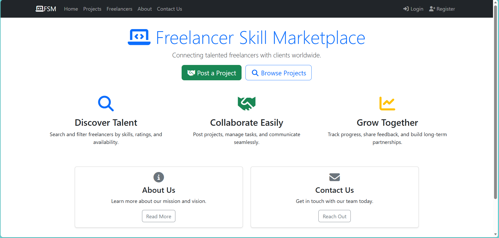
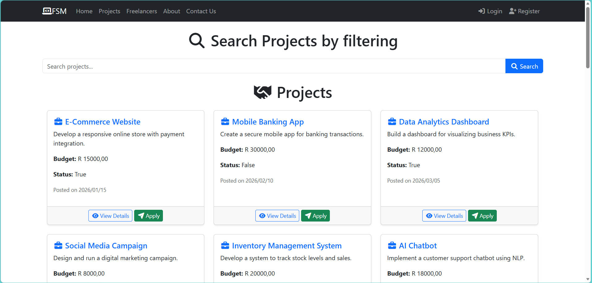
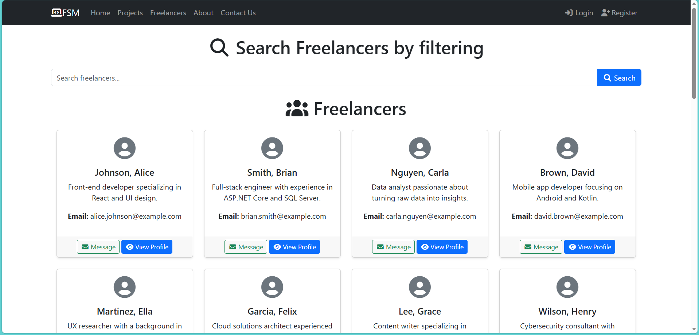
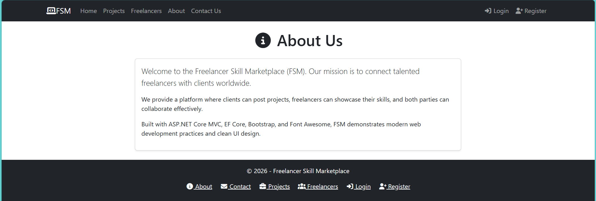
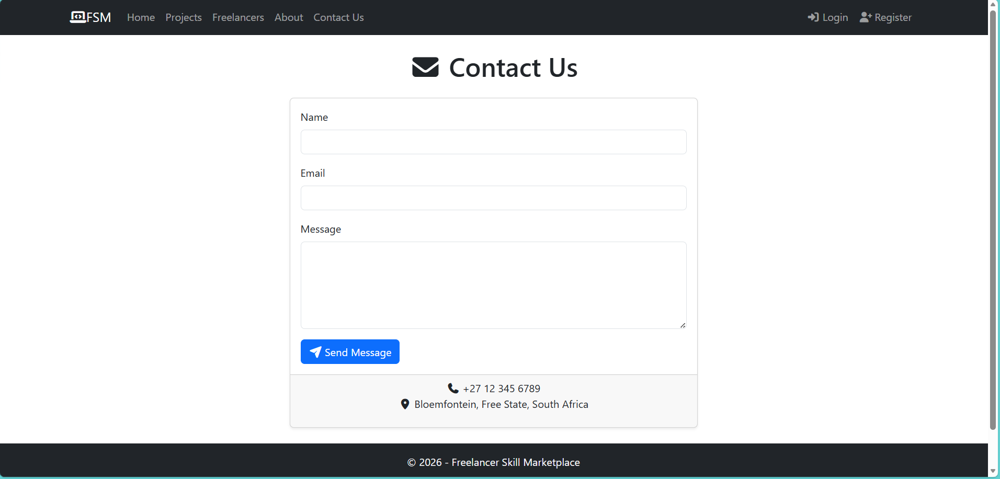
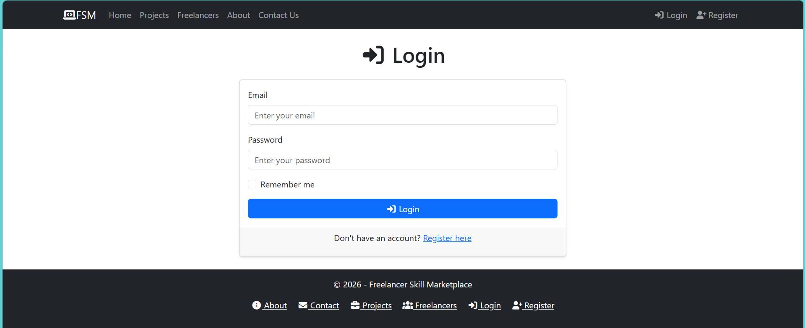
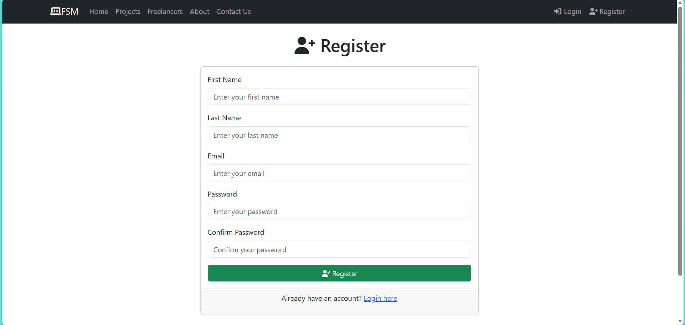

# Freelancer Skill Marketplace (FSM)

## Overview
FSM is a full-stack ASP.NET Core MVC web application that connects freelancers with clients.  
It demonstrates CRUD operations, authentication, role-based dashboards, and clean UI design.

#Screenshots
### Home Page

## Features
- **Home Page**: Landing page with call-to-action buttons.
- **Browse Skills**: Search and filter skills with levels.
- **Post Project**: Clients can create and manage projects.
- **Dashboard**: Personalized view of projects, messages, and profile.
- **Messages**: Simple communication system between users.
- **Authentication**: Login and Register with validation.

## Tech Stack
- ASP.NET Core MVC
- Entity Framework Core
- SQL Server
- Bootstrap 5
- Font Awesome 6
